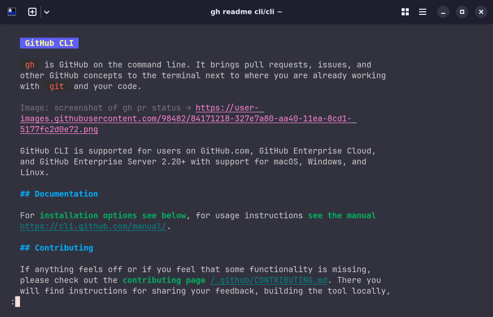

# gh-readme

A GitHub CLI extension for viewing READMEs.

## Install

```bash
gh extension install givensuman/gh-readme
```

## Usage

```
gh-readme <owner/repo> [--ref <branch|tag|sha>]
```

### Examples

```bash
gh readme cli/cli
gh readme cli/cli --ref v1.0.0
```

👇🏼



## Flags

| Flag    | Description                                     |
| ------- | ----------------------------------------------- |
| `--ref` | Branch, tag, or commit SHA to fetch README from |

## License

[MIT](./LICENSE)
